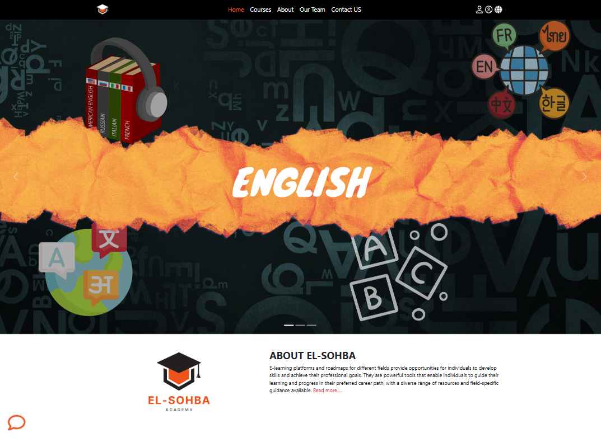

# 📚 El-Sohba – Modern Educational Platform

## 📋 Project Overview
**El-Sohba** was developed as a comprehensive educational platform by our team to create an online learning environment. The project focuses on building a user-friendly interface for students to access courses and educational content in a simple and organized way.

The main goal was to create an accessible and engaging learning platform while practicing web development skills and teamwork.

---

## 📷 Preview

---

## 🎯 Key Features

### 🏠 Home Page
- Featured courses display
- About Us section
- Meet the Team section
- Contact form
- Multi-language support

### 👥 User System
- Login and registration
- Profile management
- Course enrollment
- Progress tracking

### 💬 Communication
- Real-time chat system
- Course discussions
- Comments system
- Notifications

---

## 🛠️ Technologies Used

**Frontend:**
- HTML5 – Structure
- CSS3 – Styling & Layout
- JavaScript – Interactivity
- Bootstrap 5 – Responsive design
- Font Awesome – Icons

**Backend:**
- PHP – Server-side logic
- MySQL – Database
- PDO – Database connection

---

## � Project Structure

project/
├── 📄 index.php
├── 📄 courses.php
├── 📄 profile.php
├── 📄 login.php
├── 📄 register.php
├── 📄 about.php
├── 📄 our-team.php
├── 📄 chat.php
├── 📁 admin/
│   ├── dashboard.php
│   ├── courses.php
│   └── ...
├── 📁 includes/
│   ├── functions/
│   ├── languages/
│   └── templates/
└── 📁 layout/
    ├── css/
    ├── js/
    └── images/

---

## 👨‍💻 Development Team

- Ahmed Ismail – [LinkedIn](https://www.linkedin.com/in/ahmed-ismail-a03185255/) | [GitHub](https://github.com/AhmedMohIsmail)
- Ahmed Abdullah – [LinkedIn](https://www.linkedin.com/in/ahmed-abdullah-877981244)
- Mazen Alasas – [LinkedIn](https://www.linkedin.com/in/mazen-ahmed-772831244/)
- Abdelrahman Refaat – [LinkedIn](https://www.linkedin.com/in/abdelrahman-elgamal-b5b8832a3/)
- Ahmed Nader – [LinkedIn](https://www.linkedin.com/in/ahmed-nader-8a0a2529a) | [GitHub](https://github.com/AhmedNaderHQ)  
- Abdulrahman Mohamed – [LinkedIn](https://www.linkedin.com/in/abdo-saad-7a4b932a2/)
- Ziad Mohamed – [LinkedIn](https://www.linkedin.com/in/ziad-mohamed-759a73240)
- Ahmed Elsherbiny – [GitHub](https://github.com/AhmedElsherbiny2)
- Abdulrahman Adel – [LinkedIn](https://eg.linkedin.com/in/abdulrahman-abdelazez-36808020a)
- Abdulrahman Elmahdy

---

## 📱 Responsive Design
- Desktop 💻
- Tablet 📱
- Mobile 📲
